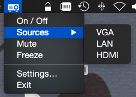

# Epson Projector Remote

This program adds a status bar icon enableing you to remote control Epson Projectors over LAN/WiFi

## Supported Hardware

The code is only tested on Epson EB-1925W, though I guess it'll work with other projectors, too. If someone wants to test it on another projector I'll be happy to update this list.

## Known issues

* The Hostname / IP is currently hardcoded
* `Settings…` does't work
* Sources are not yet customizable

## How does it work

This program emulates the projector's web interface by sending a GET request to the according URL from the web interface. The referrer of the GET request has to be set to the projector's URL, otherwise the request will ignored.

